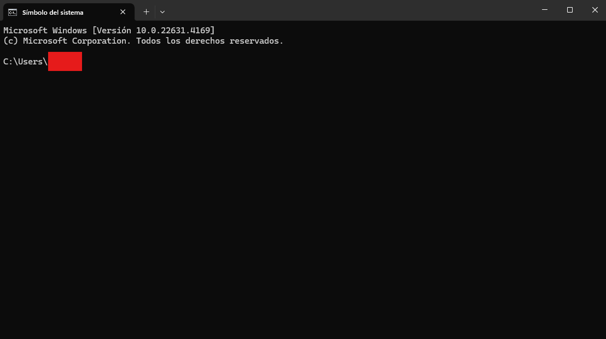

## Cómo Instalar Node.js?

Node.js llegó como una bendición para los desarrolladores de JavaScript de todo el mundo que luchan por cambiar entre múltiples lenguajes y marcos para ampliar su código en un entorno de desarrollo sostenible.

Con Node.js, por fin puedes crear aplicaciones web con conexiones bidireccionales en las que tanto el lado del servidor como el del cliente pueden comunicarse a fondo en tiempo real e intercambiar datos. De hecho, Node.js ha sido revolucionario para los desarrolladores que querían impulsar aplicaciones web en tiempo real a través de WebSocket.

Si quieres mejorar tus habilidades de desarrollo web y convertirte en un desarrollador de JavaScript full-stack, Node.js prepara el camino hacia esa entusiasta palabra de moda.

## Obejtivos

1. Que es Node.js
2. Instalar Node.js en windows
3. Version del Node.js

## abrir una terminal o el cmd de windows

1. Entrar en [Node.js](https://nodejs.org/es/download/) y descargar el instalador de Node.js en el sistema operativo deseado. Podemos elegir entre Windows, Mac y Linux.

2. Ejecutar el archivo .exe que se descargo

3. Una vez finalizado el proceso de instalación, podemos comprobar fácilmente si se nos ha instalado correctamente. Para ello, vamos al intérprete de comandos de nuestro ordenador (en Windows, por ejemplo, escribir “cmd” en la barra de búsqueda y abrir la aplicación de “Símbolo del sistema”).

4. En la ventana de comandos, escribir node -v y pulsar la tecla Enter. Nos debería aparecer la versión que tenemos instalada de Node.js (en mi caso la versión 12.19.0). Para comprobar que se nos ha instalado también NPM, escribiremos npm -v y pulsaremos de nuevo Enter. Nos debería aparecer también en este caso la versión del Node Package Manager (en mi caso la versión 6.14.8).

5. Con estos 4 sencillos pasos ya tendremos instalado y disponible para utilizar todo el potencial de Node.js junto con el instalador de paquetes NPM.

