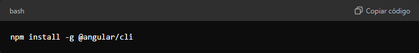
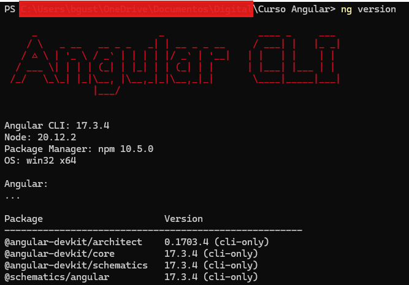
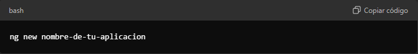
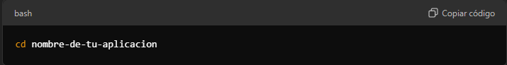
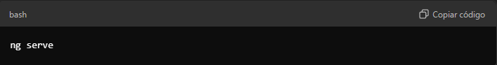

## Instalar Angular CLI

1. Una vez que tengas Node.js, abre una terminal (o el símbolo del sistema) y ejecuta el siguiente comando para instalar Angular CLI globalmente:

    ```
    npm install -g @angular/cli
    ```

    

2. Verifica si quedo bien instalado angular

    Ejecuta en el cmd

    ```
    ng version
    ```

    

3. Crear una nueva aplicación

    Usa Angular CLI para generar una nueva aplicación. En la terminal, navega a la carpeta donde deseas crear tu proyecto y ejecuta:

    

    Reemplaza nombre-de-tu-aplicacion on el nombre que desees. Durante la creación, 
    Angular CLI te preguntará si deseas incluir ciertas características (como el enrutamiento). Responde según tus preferencias.

4. Navegar al directorio de la aplicación

    Después de que Angular CLI haya creado tu proyecto, navega a la carpeta del proyecto:

    

5. Iniciar el servidor de desarrollo

    Ahora, inicia el servidor de desarrollo para ver tu aplicación en acción:

    

    Por defecto, la aplicación estará disponible en

    [LocalHost](http://localhost:4200/)

    Abre esa dirección en tu navegador y deberías ver la página de inicio de tu nueva aplicación Angular.

6. Para pausar el servidor le das clic encima de la terminal y oprimes Crontol + c


